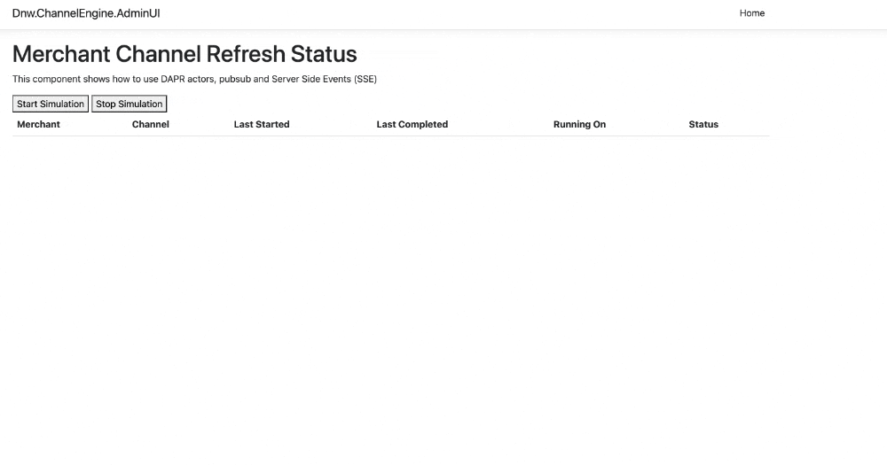

# Introduction

Proof of Concept (PoC) using the DAPR service-invocation, pubsub & actors components to build an application. The PoC also shows how to use Server Side Events (SSE) for near real-time updates.

In this case the PoC is based on a job interview at ChannelEngine. ChannelEngine allows merchants to offer their products on multiple marketplaces (channels) and needs a mechanism to periodically push product updates to all marketplaces.

Actors are a natural way to model long running processes (such as running product updates) as long as the actors don't have to handle queries when they are busy. That is because by default actors are single-threaded and process messages one by one. Actors can however still communicate with other actors (by using message passing) or with other processes (by using a message bus like the DAPR pubsub component).

Each merchant channel is implemented as an actor that uses actor reminders to schedule new product update cycles. In this example no real product updates are performed; the merchant channel actor simply waits for a random number of seconds. The actor notifies interested parties using a pubsub channel (redis is configured here). Both the Dnw.ChannelEngine.AdminUI & Dnw.ChannelEngine.MerchantManager components listen for pubsub messages. The Dnw.ChannelEngine.AdminUI component uses Server Side Events (SSE) to send the updates to the React UI, whereas the Dnw.ChannelEngine.MerchantManager detects messages from merchant channel actors that should no longer be running and asks them to stop.       

Scaling the individual components is easy. Just update the k8s manifests in the ./k8s folder. The Dnw.ChannelEngine.Actors.Host component is configured to use 2 replicas to show that actors start on any of the available pods at random (well, based on some hash). Scaling out the Dnw.ChannelEngine.MerchantManager component also works without issues (3 replicas by default). By default the DAPR pubsub component uses the 'competing consumer' model. This model ensures that when multiple pods with the same appId subscribe, only one of those pods will receive the message. This exact mechanism causes issues when scaling out the Dnw.ChannelEngine.AdminUI component though (3 replicas by default). For the AdminUI we do want all the pods to receive all the messages, so they can inform the React UI users. The issue is described well in this GitHub issue here: https://github.com/dapr/dapr/issues/3176. The 'solution' (or more work-around) described in the issue is to define 2 different pubsub components. That's also the solution implemented here. Actors publish messages to 2 separate pubsub components: one with the name "queue" and one with the name "broadcast". The AdminUI component listens to messages from the "broadcast" pubsub component, so all AdminUI pods get all the messages. The MerchantManager pods listen for messages from the "queue" pubsub component which ensures that only one of them processed the message. To test with multiple instances of the AdminUI component we also need to add a proper load balancer to our cluster (nginx-ingress for example). Port-forwarding seems to always connect to the same pod; I see no round-robin behaviour.

# Running locally

This app was created on an Apple Macbook Pro with M1 (Apple Silicon chip). To run it on an x64 machine, all Dockerfiles need to be updated:

```shell
RUN dotnet restore -r linux-musl-arm64
```

Simply remove the '-r linux-musl-arm64' argument and it should work on x64.

Also update the ./k8s/helm/templates/redis.yml file and use a x64 image:

```shell
image: arm64v8/redis:latest
```

You also need to have a k8s (KinD) cluster with a local registry at localhost:5001/ before running the deploy script. You can use the ./k8s/create_kind_cluster.sh script to create such as cluster:

```shell
cd ./k8s
./create_kind_cluster.sh
```

The DAPR cli is required before initializing the DAPR control plane: https://docs.dapr.io/getting-started/install-dapr-cli/.  

Afterwards you can initialize the DAPR control-plane like so:

```shell
dapr init -k
```

Wait until the DAPR control-plane is up-and-running. The status of all dapr namespace pods should state 'Running':

```shell
dapr status -k
```

Finally run the deploy_local.sh script to deploy everything to the k8s cluster:

```shell
cd ./k8s
./deploy_local.sh
```

This will deploy all components to the (ChannelEngine) 'ce' namespace. To view all the running pods:

```shell
kubctl get po -n ce
```

Use port-forwarding to access the Dnw.ChannelEngine.AdminUI web application:

```shell
kubectl port-forward service/admin-ui -n ce 5050:5050
```

You can now browse to http://localhost:5050 to view the admin web UI. Its fine to open multiple browser tabs / windows. With SSE, the UI will be updated near real-time in all browser tabs / windows. 

Click on the "Start Simulation" button to start the simulation. Merchant channels should start appearing almost immediately in all browser tabs / windows.

To stop the simulation click on "Stop Simulation". This will cause the MerchantManager component to send a message to all merchant actors, requesting them to stop.

